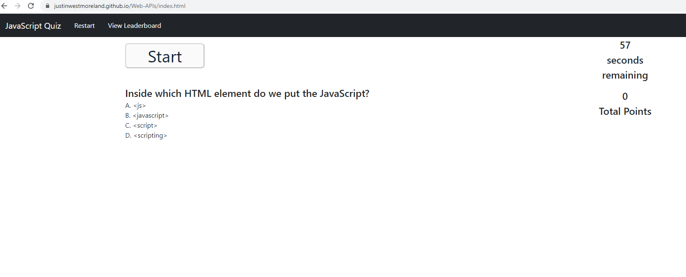
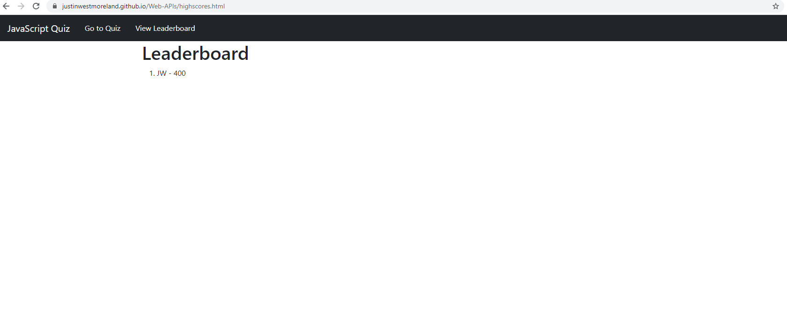

# Web-APIs

This project was a ground up build of a quiz all about JavaScript. I started by making a project outline and coded and commited updates with the following roadmap. 

1. Wireframe the quiz and leaderboard page. 
2. Create main index.html, create highscores.html, created css and js files. 
3. Mock up the front end design using css bootstrap. 
4. Started with Timer and one question scoring.
5. Build logic to continually ask question. 
6. Program leaderboard. 

This was the most challenging project of the course for me so far, but mostly due to the ambiguity of javascript programming. While googling when I hit roadblocks I would find multiple ways to solve problems and I found myself getting drawn towards finding out which one was more correct, which was futile. 

The project also gave me my first exposure of hours of bug chasing. Although rewarding when found, it was one of the most frustrating processes to date. Looking back, it gave me a much deeper understanding of my code. 

I hope you enjoy my quiz! 

